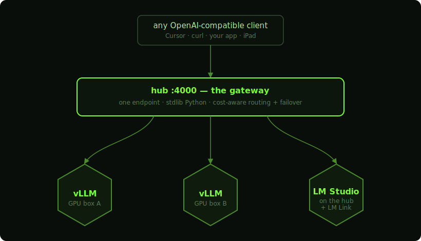
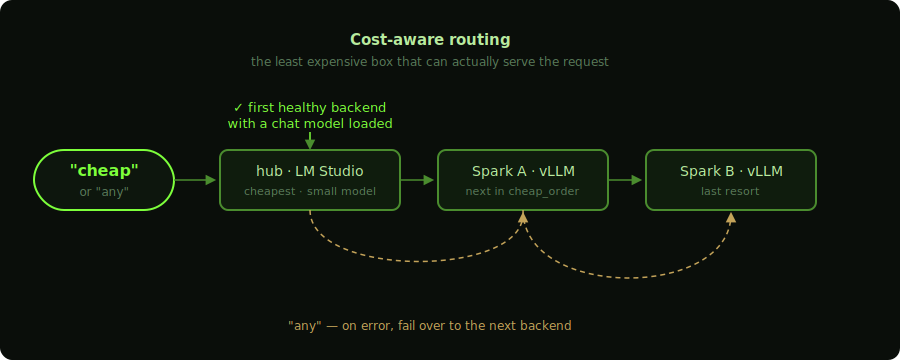

<div align="center">


# Honeycomb

**Every GPU you own — one living map.**

A control plane and OpenAI-compatible gateway for your home AI fleet:
route every model through one endpoint, watch traffic light up the map,
and drive it all from your Mac, iPad, or phone.


[**Install**](#install) · [**Quickstart**](#install) · [**How it works**](#the-gateway) · [**Web dashboard**](#web-dashboard)

</div>

## What it does

<table>
<tr>
<td width="50%" valign="top">

**🔌 One API for the whole fleet**

Point any OpenAI-compatible client at `http://<hub>:4000/v1`. Route by
alias to vLLM boxes, LM Studio, or any endpoint. `cheap` picks the least
expensive healthy backend; `any` adds automatic failover mid-request.

</td>
<td width="50%" valign="top">

**🗺️ A map that tells the truth**

Each node is a hex — color is health, and it goes **LIT** with animated
pulses when traffic flows. The inspector shows real GPU %, memory,
KV-cache, tok/s, and latency trend. Never a catalog dump.

</td>
</tr>
<tr>
<td width="50%" valign="top">

**🛠️ Fleet control from the map**

**PING** a node through the real wire, **SERVE / STOP** its inference
container over SSH, and **DOCTOR** it with
[spark-doctor](https://github.com/joeynyc/spark-doctor) — auto-run when a
node fails, so the "why" is already waiting.

</td>
<td width="50%" valign="top">

**📱 Works everywhere**

A native macOS app (menu bar + notifications) **and** a self-contained
web dashboard the gateway serves itself. Open it on an iPad or phone, Add
to Home Screen, and run the fleet from anywhere over Tailscale.

</td>
</tr>
</table>

## Architecture

<div align="center">

</div>

The hub is the Mac that runs the gateway and the app. Everything the
system believes about your fleet lives in one file: `fleet.json`.

## Install

### Download the app (no build tools needed)

Grab `Honeycomb-<version>-macos-universal.zip` from Releases, unzip, and
drag **Honeycomb.app** to `/Applications`. The app is universal (Apple
Silicon + Intel) and **carries the gateway inside it** — if the gateway
isn't running, the map offers a **START GATEWAY** button.

> **First launch:** the app is signed ad-hoc, not notarized (that needs a
> paid Apple Developer ID). macOS will refuse a plain double-click.
> **Right-click the app → Open → Open** once; after that it launches
> normally. Everything it runs is in this repo — read it before you trust it.

Requirements: macOS 14+, `python3` (from Xcode Command Line Tools:
`xcode-select --install`), and SSH keys to your GPU boxes. Optional per
feature: vLLM on the boxes, LM Studio + LM Link, Docker (SERVE/STOP),
[spark-doctor](https://github.com/joeynyc/spark-doctor) (DOCTOR).

Then describe your machines — the app shows the exact path, and names any
mistake it finds:

- **fleet.json** → `~/Library/Application Support/Honeycomb/fleet.json`
  (see [fleet.example.json](fleet.example.json))
- **gateway config** → `~/Library/Application Support/Honeycomb/gateway-config.json`
  (seeded from the example on first start; set a `control_token`)

The web dashboard is then live at `http://<hub-ip>:4000` for any browser,
iPad, or phone.

### Build from source

```bash
git clone <this repo> && cd honeycomb-lab
cp gateway/config.example.json gateway/config.json   # edit backends + token
(cd gateway && ./start.sh)                           # → http://0.0.0.0:4000
./Scripts/compile_and_run.sh                         # build + package + launch
cp -R Honeycomb.app /Applications/

./Scripts/make_release.sh    # universal .zip in dist/, for distribution
```

To run the gateway as a service (start at login, restart on crash), see [docs/launchd.md](docs/launchd.md).

## The gateway

| Model id | Routes to |
|----------|-----------|
| `cheap` | Cheapest healthy backend with a chat model loaded (`cheap_order` in config) |
| `any` | Like `cheap`, plus automatic failover to the next backend on upstream errors |
| *your aliases* | Whatever you define in `config.json` (e.g. `spark-main` → box A's vLLM) |
| `backend/<model>` | Explicit model on an explicit backend |

Any alias can opt into failover per-request with `"failover": true`.
Aliases with no pinned model auto-pick the backend's first chat-capable
model (embedding models are skipped).

<div align="center">

</div>

Endpoints: `/v1/chat/completions` · `/v1/completions` · `/v1/embeddings`
(all proxied, stream + non-stream) · `/health` (backends, activity,
stats) · `/nodes` (fleet status for the dashboard) · `/requests` (recent
traffic) · `/control/*` (ping / doctor / container — see security below).

## fleet.json

Nodes are described in `~/Library/Application Support/Honeycomb/fleet.json`
(created from the bundled default on first launch; `HONEYCOMB_FLEET` env
var overrides the path). Start from `fleet.example.json`.

**Probe types:**
- `vllm-ssh` — a GPU box running vLLM; SSH reachability = online, metrics
  via `nvidia-smi`/`free`, throughput via vLLM's `/metrics`.
- `lmstudio-hub` — the hub itself, serving via LM Studio.
- `lmlink-peer` — a remote GPU reached through the hub's LM Studio via
  LM Link (`lmLinkPeer` = the peer's device name).
- `http-only` — any OpenAI-compatible endpoint, health by HTTP only.

**Per-node fields:** `gatewayBackend` + `litAliases` map the node to a
gateway backend so its hex lights on traffic; `pingAlias` enables PING;
`container` (+ `sshHost`) enables SERVE/STOP; `doctorCommand` enables
DOCTOR; `hub: true` marks the center node; `axial: [q, r]` pins the map
position; top-level `links` adds extra edges between nodes.

## Web dashboard

Served by the gateway at `/` for browsers (API clients still get JSON).
Full feature parity: map, LIT pulses, inspector with metrics + latency
trend, traffic feed, and PING/DOCTOR/SERVE/STOP.

**Security model:**
- Control actions (`/control/*`) require the `X-Honeycomb-Token` header
  from anywhere but localhost. Set `control_token` in `config.json`
  (`openssl rand -hex 16`); the dashboard prompts once and remembers it.
  The example config's `__REPLACE_ME__` sentinel never authorizes.
- Requests must address the hub by IP literal or localhost. To reach it
  by hostname (e.g. a tailnet MagicDNS name), add that name to
  `allowed_hosts` — this blocks DNS-rebinding attacks that would
  otherwise let a malicious web page inherit the localhost exemption.
- Control responses carry no CORS headers, so a page in your browser
  can't script them; doctor findings in `/nodes` are only returned to
  authorized callers.
- There is no TLS: the gateway is built for a trusted LAN or a tailnet
  (Tailscale/WireGuard), not the open internet. Don't port-forward it.

## spark-doctor integration

Give any `vllm-ssh` node a `doctorCommand` that prints a
[spark-doctor](https://github.com/joeynyc/spark-doctor) scan JSON to
stdout, and Honeycomb runs it on demand (DOCTOR button) and automatically
when inference dies or the node drops — findings render right in the
inspector, and fresh critical findings turn an online hex amber.

## License

MIT — see [LICENSE](LICENSE).
