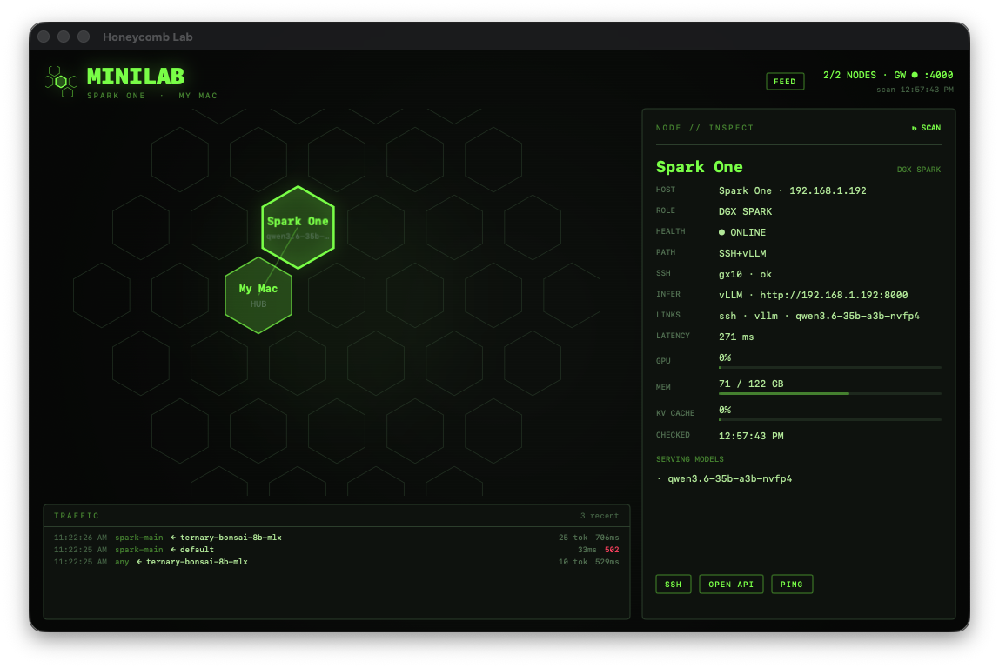

# Honeycomb Lab

A control plane for your home AI fleet: a phosphor-green hex map of every
GPU box you own, plus an OpenAI-compatible gateway that routes to all of
them through one URL — with cost-aware routing, failover, live metrics,
and one-tap node control. macOS app + web dashboard for iPad/iPhone/any
browser.



## What it does

- **One API for the whole fleet** — point any OpenAI-compatible client at
  `http://<hub>:4000/v1` and route by alias to vLLM boxes, LM Studio, or
  any OpenAI-compatible endpoint. `model: "cheap"` picks the least
  expensive healthy backend; `model: "any"` adds automatic failover when
  a backend dies mid-request.
- **A map that tells the truth** — each node is a hex: outline color is
  health, hexes go **LIT** with animated pulses when traffic flows through
  the gateway, and the inspector shows GPU %, unified memory, KV-cache,
  tok/s, latency trend, and what's actually loaded (never a catalog dump).
- **Fleet control from the map** — PING (one-shot prompt through the real
  wire), SERVE/STOP (docker start/stop of a node's inference container
  over SSH, with confirmation), and DOCTOR
  ([spark-doctor](https://github.com/joeynyc/spark-doctor) diagnostics,
  auto-run when a node fails so the "why" is waiting for you).
- **Works everywhere** — native macOS app (menu bar + notifications) and
  a self-contained web dashboard served by the gateway itself: open it on
  an iPad/iPhone, Add to Home Screen, and control the fleet from anywhere
  (pairs perfectly with Tailscale).

## Architecture

```
 any OpenAI-compatible client
            │
            ▼
      hub :4000  ← gateway (Python, stdlib only)
            │
   ┌────────┼──────────────┐
   ▼        ▼              ▼
 vLLM     vLLM        LM Studio (+ LM Link peers)
 box A    box B       on the hub
```

The hub is the Mac that runs the gateway and the app. Everything the
system believes about your fleet lives in one file: `fleet.json`.

## Quickstart

Requirements: macOS 14+ on the hub (Swift 6 toolchain for the app),
Python 3.11+, SSH keys to your GPU boxes. Optional per feature: vLLM on
the GPU boxes, LM Studio + LM Link, Docker (for SERVE/STOP),
spark-doctor (for DOCTOR).

```bash
git clone <this repo> && cd honeycomb-lab

# 1. Gateway: describe your backends
cp gateway/config.example.json gateway/config.json   # edit IPs/aliases
cd gateway && ./start.sh                             # → http://0.0.0.0:4000

# 2. App (first launch copies the bundled fleet to
#    ~/Library/Application Support/Honeycomb/fleet.json — edit it there)
./Scripts/compile_and_run.sh          # builds + packages + launches
cp -R Honeycomb.app /Applications/    # keep a real install

# 3. Web dashboard — already live: open http://<hub-ip>:4000 in a browser
```

To run the gateway as a service (start at login, restart on crash), see
`docs/launchd.md` pattern in the launchctl comments of `gateway/start.sh`,
or create a LaunchAgent that runs `gateway/start.sh`.

## The gateway

| Model id | Routes to |
|----------|-----------|
| `cheap` | Cheapest healthy backend with a chat model loaded (`cheap_order` in config) |
| `any` | Like `cheap`, plus automatic failover to the next backend on upstream errors |
| *your aliases* | Whatever you define in `config.json` (e.g. `spark-main` → box A's vLLM) |
| `backend/<model>` | Explicit model on an explicit backend |

Any alias can opt into failover per-request with `"failover": true`.
Aliases with no pinned model auto-pick the backend's first chat-capable
model (embedding models are skipped).

Endpoints: `/v1/chat/completions` · `/v1/completions` · `/v1/embeddings`
(all proxied, stream + non-stream) · `/health` (backends, activity,
stats) · `/nodes` (fleet status for the dashboard) · `/requests` (recent
traffic) · `/control/*` (ping / doctor / container — see security below).

## fleet.json

Nodes are described in `~/Library/Application Support/Honeycomb/fleet.json`
(created from the bundled default on first launch; `HONEYCOMB_FLEET` env
var overrides the path). Start from `fleet.example.json`.

**Probe types:**
- `vllm-ssh` — a GPU box running vLLM; SSH reachability = online, metrics
  via `nvidia-smi`/`free`, throughput via vLLM's `/metrics`.
- `lmstudio-hub` — the hub itself, serving via LM Studio.
- `lmlink-peer` — a remote GPU reached through the hub's LM Studio via
  LM Link (`lmLinkPeer` = the peer's device name).
- `http-only` — any OpenAI-compatible endpoint, health by HTTP only.

**Per-node fields:** `gatewayBackend` + `litAliases` map the node to a
gateway backend so its hex lights on traffic; `pingAlias` enables PING;
`container` (+ `sshHost`) enables SERVE/STOP; `doctorCommand` enables
DOCTOR; `hub: true` marks the center node; `axial: [q, r]` pins the map
position; top-level `links` adds extra edges between nodes.

## Web dashboard

Served by the gateway at `/` for browsers (API clients still get JSON).
Full feature parity: map, LIT pulses, inspector with metrics + latency
trend, traffic feed, and PING/DOCTOR/SERVE/STOP.

**Security:** control actions from anywhere but localhost require the
`X-Honeycomb-Token` header. Set `control_token` in `gateway/config.json`
(e.g. `openssl rand -hex 16`); the dashboard prompts once and remembers
it. The gateway listens LAN-wide by default — keep it on a trusted
network or a tailnet.

## spark-doctor integration

Give any `vllm-ssh` node a `doctorCommand` that prints a
[spark-doctor](https://github.com/joeynyc/spark-doctor) scan JSON to
stdout, and Honeycomb runs it on demand (DOCTOR button) and automatically
when inference dies or the node drops — findings render right in the
inspector, and fresh critical findings turn an online hex amber.

## License

MIT — see [LICENSE](LICENSE).
